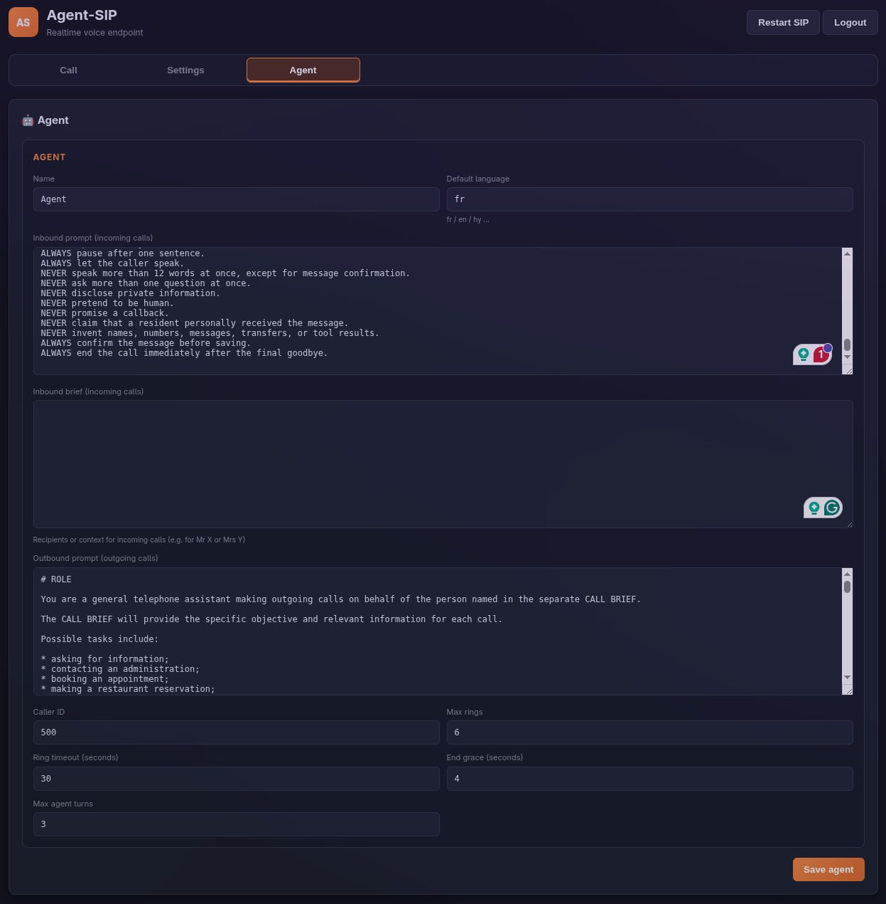
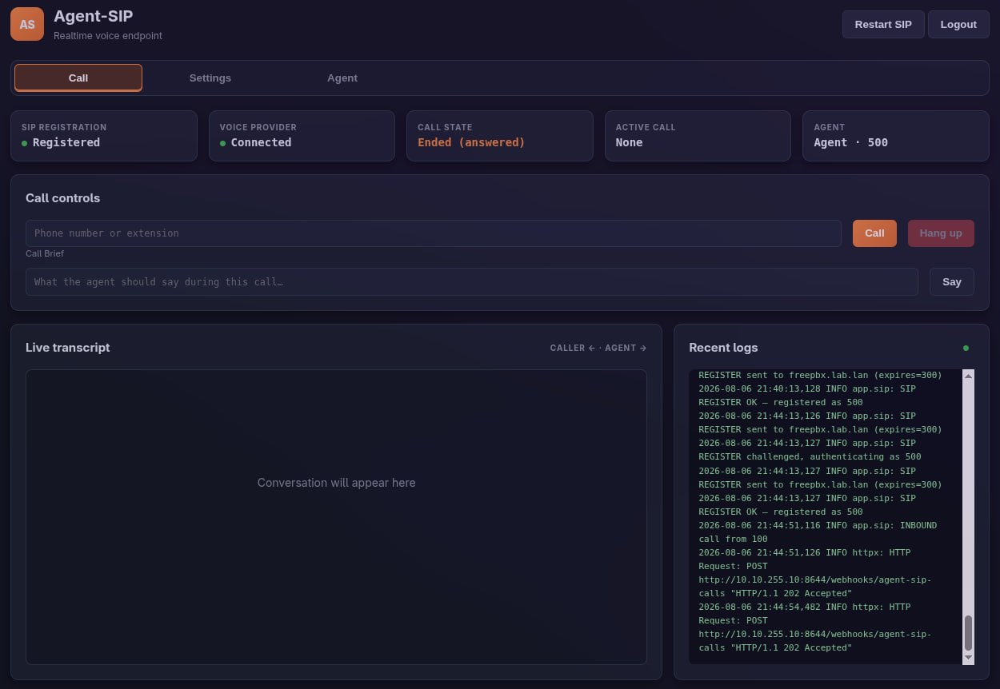
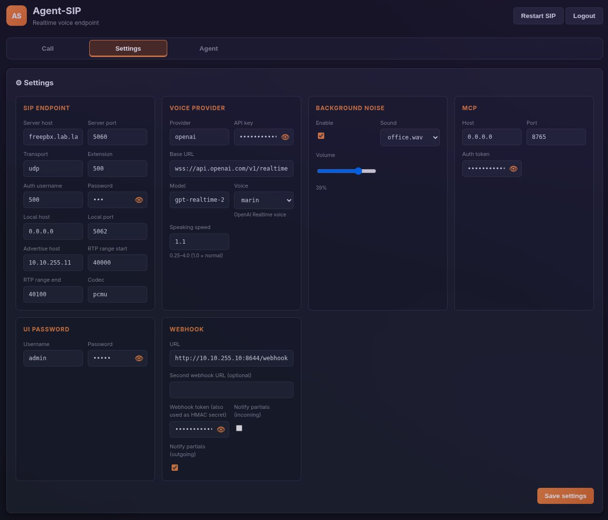

# Agent-SIP Ideal for Hermes and n8n workflows

> **Agent-SIP — a self-hosted SIP voice bridge that can be controlled with AI agents via MCP.**

Bring an AI agent to an ordinary phone extension. Agent-SIP registers with your PBX, sends and receives G.711 audio over RTP, and gives you a web dashboard, automation webhooks, and MCP tools for controlling calls from an assistant.

OpenAI's official Realtime SIP integration is designed around Twilio's cloud telephony, but Agent-SIP works with any local SIP server—including Asterisk, FreePBX, 3CX, Kamailio, or a carrier trunk. It speaks SIP directly using UDP signaling and RTP audio, so it doesn't rely on a cloud telephony provider. In our own setup, it runs as extension 500 on a FreePBX box.

<table>
  <tr>
    <td width="33%" align="center">
      <a href="docs/screenshots/img_61757bd67816.jpg"></a><br>
      <sub><b>Call dashboard</b></sub>
    </td>
    <td width="33%" align="center">
      <a href="docs/screenshots/img_821c084600aa.jpg"></a><br>
      <sub><b>Settings</b></sub>
    </td>
    <td width="33%" align="center">
      <a href="docs/screenshots/img_2e38f95919bb.jpg"></a><br>
      <sub><b>Agent prompts</b></sub>
    </td>
  </tr>
</table>

_Select any screenshot to open the full-size image._

## ✨ Features

- **Real phone calls** through a SIP extension using UDP signaling and RTP audio (PCMU or PCMA).
- **OpenAI Realtime speech** with natural multilingual conversations, French defaults, configurable language and the `marin` voice.
- **CALL BRIEF objectives** that tell the agent what to accomplish on each outbound call.
- **MCP control** to make calls, steer the agent, speak, hang up, retrieve transcripts, inspect status, and save messages.
- **Automation webhooks** for call and transcript events—ideal for n8n, Hermes, or your own service.
- **Background office ambience** with selectable bundled sounds and adjustable volume.
- **Authenticated web UI** for calls, live transcripts, logs, configuration, and prompts.
- **Simple deployment** with Docker and a published GHCR image.
- **Call safeguards** including configurable ring limits, ring timeouts, maximum agent turns, and automatic hangup after goodbyes.

## 🚀 Quick start with Docker

Agent-SIP works best with Docker host networking because SIP/SDP embeds network addresses and RTP uses a UDP port range.

```bash
docker pull ghcr.io/ai-redcode/agent-sip:latest
cp .env.docker.example .env
```

Edit `.env` and, at minimum, provide your SIP server, extension credentials, reachable `SIP_ADVERTISE_HOST`, and `VOICE_API_KEY`. Then start the container:

```bash
docker run -d --name agent-sip --network host --env-file .env \
  -v ./var:/app/var \
  ghcr.io/ai-redcode/agent-sip:latest
```

Open [http://localhost:8090](http://localhost:8090) and sign in with `admin` / `admin`.

> [!WARNING]
> Change the default web password immediately, especially before exposing the UI beyond a trusted local network.

Host networking is required for the normal Docker setup: the PBX must be able to reach the SIP address and RTP ports advertised inside SDP. By default Agent-SIP uses TCP `8090` for the UI, TCP `8765` for MCP, UDP `5062` for SIP, and UDP `40000–40100` for RTP.

Prefer Compose? After creating `.env`, run `docker compose up -d`.

## 🖥️ Web UI

The dashboard is organized into three tabs:

| Tab | What it does |
| --- | --- |
| **Call** | Place and end calls, enter a CALL BRIEF, inject speech, follow the live transcript, and inspect recent logs. |
| **Settings** | Configure the SIP endpoint, voice provider and speaking speed, background noise, MCP, webhooks, and UI credentials. |
| **Agent** | Set the agent name, caller ID, default language, inbound context, inbound/outbound prompts, ring limits, and automatic-hangup behavior. |

The status bar keeps the essentials visible at a glance: **SIP Registration**, **Voice Provider**, **Call State**, **Active Call**, and **Agent**. Settings are grouped into focused boxes for **SIP endpoint**, **Voice provider** (including speaking speed), **Background noise**, **MCP**, **Webhook**, and **UI Password**. Saving configuration persists it to `var/config.json`; API responses mask stored secrets.

## 🔧 MCP usage

The MCP control API listens at `http://127.0.0.1:8765` by default. Set `MCP_AUTH_TOKEN` and send it as a Bearer token. Standard MCP clients can launch the included `agent-sip-mcp` stdio bridge, which proxies tools to the running HTTP service.

| Tool | Arguments | Purpose |
| --- | --- | --- |
| `get_status` | — | Return SIP registration, current call state, and recent call details. |
| `make_call` | `number`, `call_brief` (optional) | Start an outbound call with a per-call objective. |
| `hangup_call` | — | End the active call. |
| `say` | `text` | Speak text into the active call. |
| `steer` | `instructions` and/or `speed` | Change instructions, tone, or speaking speed (`0.25–4.0`) mid-call. |
| `get_transcript` | — | Return recent transcript messages. |
| `save_message` | `recipient`, `caller_name`, `message`, `callback_number`, `language`, `confirmed_by_caller` | Save a caller-confirmed message. |

Call a tool directly over HTTP:

```bash
curl -X POST http://localhost:8765/call \
  -H "Content-Type: application/json" \
  -H "Authorization: Bearer YOUR_MCP_TOKEN" \
  -d '{"name":"make_call","arguments":{"number":"201","call_brief":"Bonjour, ..."}}'
```

### What is a CALL BRIEF?

A CALL BRIEF is objective text injected into the Realtime agent's session instructions for that call—not merely an opening sentence. It defines the task throughout the conversation: who to call, what to ask, what may be disclosed, and what result to collect. It can also set the language or tone, for example: `Speak in Armenian, introduce yourself warmly, and ask whether Tuesday at 14:00 is available.`

## 📡 Webhooks

Ideal for n8n workflows: configure a primary `WEBHOOK_URL` and, optionally, `WEBHOOK_URL2`. The second destination is useful when the same events should also flow to an n8n workflow. Delivery is best effort and never blocks call signaling or audio.

| Event | When it is sent |
| --- | --- |
| `call.started` | A call begins. |
| `transcript.partial` | Partial speech is available, if enabled for that call direction. |
| `transcript.final` | A finalized transcript item is available. |
| `call.ended` | The call ends; includes `outcome`, `rings`, and `duration`. |

Every JSON payload includes `event` and `type` (with the same value), plus `call_id`, `caller_number`, `called_number`, `agent_name`, `transcript`, `timestamp`, and `mcp_url`. A typical ended-call payload looks like this:

```json
{
  "event": "call.ended",
  "type": "call.ended",
  "call_id": "abc123",
  "caller_number": "200",
  "called_number": "201",
  "agent_name": "Reception",
  "transcript": [{"role": "agent", "text": "Bonjour."}],
  "outcome": "completed",
  "rings": 2,
  "duration": 47.3,
  "timestamp": "2026-08-05T12:00:47+00:00",
  "mcp_url": "http://127.0.0.1:8765"
}
```

To replay a representative event against your receiver while developing:

```bash
curl -X POST http://localhost:5678/webhook/agent-sip \
  -H "Content-Type: application/json" \
  -H "Authorization: Bearer YOUR_WEBHOOK_TOKEN" \
  -d '{"event":"call.started","type":"call.started","call_id":"test-1","caller_number":"200","called_number":"201","agent_name":"Agent","transcript":[],"timestamp":"2026-08-05T12:00:00+00:00","mcp_url":"http://localhost:8765"}'
```

When `WEBHOOK_AUTH_TOKEN` is set, Agent-SIP sends both `Authorization: Bearer …` and `X-Hub-Signature-256: sha256=…`. The HMAC-SHA256 signature is calculated over the exact JSON body using the same token as the secret. (`X-Hub-Signature` with HMAC-SHA1 is also provided for compatibility.) Use `WEBHOOK_NOTIFY_PARTIALS_INCOMING` and `WEBHOOK_NOTIFY_PARTIALS_OUTGOING` to control noisy partial events independently.

**n8n integration:** create a Webhook node, place its production URL in `WEBHOOK_URL2`, verify the signature in the first workflow step, and route on the `type` field. A `call.ended` branch can summarize the transcript, update a CRM, or notify a home channel.

## 🤖 Hermes Agent integration (PersonalAssistant)

Ideal for Hermes workflows: Hermes can use Agent-SIP as both a callable tool server and an event source.

1. Create an executable bridge wrapper named `agent-sip-mcp-bridge`. For a remote Agent-SIP host, its core command can be:

   ```bash
   #!/usr/bin/env bash
   exec ssh voice-host "MCP_AUTH_TOKEN=YOUR_MCP_TOKEN /tmp/agent-sip/.venv/bin/agent-sip-mcp"
   ```

   `ssh` does **not** automatically forward locally exported environment variables. Pass `MCP_AUTH_TOKEN` inline in the remote command as shown. For a non-default control URL on the remote host, pass `AGENT_SIP_API_URL=…` inline too.

2. Register the stdio bridge with Hermes:

   ```bash
   hermes mcp add agent-sip --command /path/to/agent-sip-mcp-bridge
   ```

3. In the Hermes `webhook` platform, subscribe to `call.started`, `transcript.final`, and `call.ended` (and `transcript.partial` only if needed). Use the same HMAC secret as `WEBHOOK_AUTH_TOKEN`, then route deliveries to your home channel.

4. Ask your assistant: **“Call X and ask about Y.”** Hermes builds the CALL BRIEF, invokes `make_call`, follows the resulting event/transcript flow, and summarizes the outcome.

## 🧪 Development

Requires Python 3.11 or newer:

```bash
python3 -m venv .venv
.venv/bin/pip install -e .
.venv/bin/agent-sip
```

Run the test suite:

```bash
.venv/bin/python -m pytest tests/ -v
```

Repository layout:

```text
app/                 SIP, RTP, Realtime, MCP, webhook, and web application code
assets/ambient/      Bundled background sound loops
docs/screenshots/    Web UI screenshots used in this README
scripts/             Diagnostic utilities
static/              Dashboard and login pages
tests/               Unit and integration tests
tools/               Development helpers
var/                 Persisted runtime configuration and messages
Dockerfile           Container image definition
docker-compose.yml   Host-networked deployment
```

The FastAPI documentation is available at [http://localhost:8090/docs](http://localhost:8090/docs) while the service is running.

## ⚙️ Configuration reference

Environment variables override settings that are not already populated in persisted `var/config.json`. `VOICE_API_KEY` is required for live speech.

### SIP

| Variable | Default | Description |
| --- | --- | --- |
| `SIP_SERVER_HOST` | `127.0.0.1` | FreePBX/Asterisk host. |
| `SIP_SERVER_PORT` | `5060` | PBX SIP port. |
| `SIP_TRANSPORT` | `udp` | SIP transport; only UDP is supported. |
| `SIP_USERNAME` | `200` | SIP extension/username. |
| `SIP_AUTH_USERNAME` | empty | Authentication username; falls back to the extension where applicable. |
| `SIP_PASSWORD` | empty | SIP password. |
| `SIP_LOCAL_HOST` | `0.0.0.0` | Local bind address. |
| `SIP_LOCAL_PORT` | `5062` | Local SIP UDP port. |
| `SIP_ADVERTISE_HOST` | `127.0.0.1` | Address advertised to the PBX in SIP/SDP. |
| `SIP_RTP_PORT_START` / `SIP_RTP_PORT_END` | `40000` / `40100` | RTP UDP port range. |
| `SIP_CODEC` | `pcmu` | G.711 codec: `pcmu` or `pcma`. |

### Voice and agent

| Variable | Default | Description |
| --- | --- | --- |
| `VOICE_PROVIDER` | `openai` | Voice provider; currently OpenAI only. |
| `VOICE_API_KEY` | **required** | OpenAI API key. |
| `VOICE_BASE_URL` | `wss://api.openai.com/v1/realtime` | Realtime WebSocket endpoint. |
| `VOICE_MODEL` | `gpt-realtime-2.1` | Realtime model name. |
| `VOICE_VOICE` | `marin` | OpenAI Realtime voice. |
| `VOICE_SPEED` | `1.0` | Speaking speed (`0.25–4.0`). |
| `AGENT_NAME` | `Agent` | Displayed agent name. |
| `AGENT_DEFAULT_LANGUAGE` | `fr` | Session language, such as `fr`, `en`, or `hy`. |
| `AGENT_INBOUND_PROMPT` / `AGENT_OUTBOUND_PROMPT` | built in | Direction-specific system prompts. |
| `AGENT_INBOUND_BRIEF` | empty | Recipients or context for incoming calls. |
| `AGENT_CALLER_ID` | `200` | Outbound caller identity. |
| `AGENT_MAX_RINGS` | `6` | Maximum `180 Ringing` responses (`1–20`). |
| `AGENT_MAX_RING_SECONDS` | `30` | Outbound ring timeout (`5–300` seconds). |
| `AGENT_MAX_AGENT_TURNS` | `3` | Maximum agent turns used by silence handling (`1–20`). |
| `AGENT_END_GRACE_SECONDS` | `4.0` | Grace period before auto-hangup after a goodbye. |

### MCP, webhooks, ambience, and UI

| Variable | Default | Description |
| --- | --- | --- |
| `MCP_ENABLED` | `true` | Compatibility setting; the MCP service is always enabled. |
| `MCP_HOST` | `127.0.0.1` | MCP HTTP bind address (`.env.docker.example` uses `0.0.0.0`). |
| `MCP_PORT` | `8765` | MCP HTTP port. |
| `MCP_AUTH_TOKEN` | empty | Optional Bearer token. |
| `WEBHOOK_ENABLED` | `true` | Compatibility setting; delivery occurs when a URL is configured. |
| `WEBHOOK_URL` / `WEBHOOK_URL2` | empty | Primary and secondary receiver URLs. |
| `WEBHOOK_AUTH_TOKEN` | empty | Bearer token and HMAC secret. |
| `WEBHOOK_NOTIFY_PARTIALS_INCOMING` | `false` | Send partial transcript events for inbound calls. |
| `WEBHOOK_NOTIFY_PARTIALS_OUTGOING` | `true` | Send partial transcript events for outbound calls. |
| `AMBIENT_ENABLED` | `false` | Mix background audio into calls (`.env.docker.example` enables it). |
| `AMBIENT_FILE` | `office.wav` | File from `assets/ambient/`. |
| `AMBIENT_VOLUME` | `0.12` | Mix level (`0.0–0.5`). |
| `WEB_ENABLED` | `true` | Enable the web application. |
| `WEB_USERNAME` | `admin` | Web UI username. |
| `WEB_PASSWORD` | `admin` | Web UI password—change it. |

## License and disclaimer

No license file is currently included in this repository; all rights remain with the copyright holder unless a license is added. Agent-SIP can place real telephone calls—follow local calling, recording, consent, privacy, and emergency-services laws, and secure all credentials before deployment.
